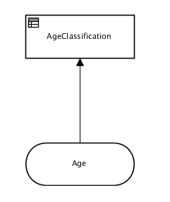
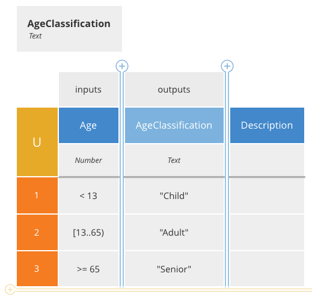

# DMN and KIE

This repo attempts to illustrate the different ways of invoking Decision Model and Notation (DMN) that are wrapped in Knowledge is Everything (KIE) deployments.

## A Simple "Decision"

In order to focus on the interaction, the simplest of "decisions" was concocted.  This simple classification type decision takes a Age of movie patron, and determines an Age Classification code.   Here is the DRD:



And here is the Decision Table logic inside the AgeClassification decision:



The decision is defined [here](src/main/resources/movies-ageclassification.dmn), and the images were generated using the [Trisotech DMN Authoring Tool](https://www.trisotech.com/release-notes/dmn-modeler)

## KIE Decision Invocation

Note, need the specific **namespace** and **name** defined in the DMN file to successfully invoke a decision.

* [EmbeddedDMNTest.java](src/test/java/com/dmn/example/EmbeddedDMNTest.java) Illustrates invoking a decision directly inside Java code

* [RemoteDMNClientTest](src/test/java/com/dmn/example/RemoteDMNClientTest.java) invokes remotely using the KIE Services Client

  * This example assumes the decision has been deployed to a local KIE execution server, and has a service user identified by krisv/krisv

  * Must build and deploy (see curl command in last section) before this test will work

* Invoking outside of Java can be accomplished by directly hitting the Rest API of the KIE Execution server

## Curl Examples

Retrieve the deployed DMN model(s):

```
curl -u krisv:krisv -X GET "http://localhost:8080/kie-server/services/rest/server/containers/MovieDMNContainer/dmn" -H "accept: application/xml"
```

Example response:

```xml
<?xml version="1.0" encoding="UTF-8" standalone="yes"?>
<response type="SUCCESS" msg="OK models successfully retrieved from container 'MovieDMNContainer'">
    <dmn-model-info-list>
        <model>
            <model-namespace>http://www.redhat.com/_c7328033-c355-43cd-b616-0aceef80e52a</model-namespace>
            <model-name>dmn-movieticket-ageclassification</model-name>
            <model-id>_99</model-id>
            <decisions>
                <dmn-decision-info>
                    <decision-id>_3</decision-id>
                    <decision-name>AgeClassification</decision-name>
                </dmn-decision-info>
            </decisions>
        </model>
    </dmn-model-info-list>
</response>
```

Invoke the decision with the **model-namespace** and **model-name** values:

POST: http://localhost:8080/kie-server/services/rest/server/containers/MovieDMNContainer/dmn

```
curl -u krisv:krisv -X POST "http://localhost:8080/kie-server/services/rest/server/containers/MovieDMNContainer/dmn" -H "accept: application/xml" -H "content-type: application/json" -d "{ \"model-namespace\" : \"http://www.redhat.com/_c7328033-c355-43cd-b616-0aceef80e52a\", \"model-name\" : \"dmn-movieticket-ageclassification\", \"decision-name\" : [ ], \"decision-id\" : [ ], \"dmn-context\" : {\"Age\" : 66}}"
```

Pretty request:
```json
{
  "model-namespace" : "http://www.redhat.com/_c7328033-c355-43cd-b616-0aceef80e52a",
  "model-name" : "dmn-movieticket-ageclassification",
  "decision-name" : [ ],
  "decision-id" : [ ],
  "dmn-context" : {"Age" : 66}
}
```

Sample response:

```json
{
  "type" : "SUCCESS",
  "msg" : "OK from container 'MovieDMNContainer'",
  "result" : {
    "dmn-evaluation-result" : {
      "messages" : [ ],
      "model-namespace" : "http://www.redhat.com/_c7328033-c355-43cd-b616-0aceef80e52a",
      "model-name" : "dmn-movieticket-ageclassification",
      "decision-name" : [ ],
      "dmn-context" : {
        "Age" : 66,
        "AgeClassification" : "Senior"
      },
      "decision-results" : {
        "_3" : {
          "messages" : [ ],
          "decision-id" : "_3",
          "decision-name" : "AgeClassification",
          "result" : "Senior",
          "status" : "SUCCEEDED"
        }
      }
    }
  }
}
```

Same example in XML, request:

```xml
<?xml version="1.0" encoding="UTF-8"?>
<dmn-evaluation-context>
    <model-namespace>http://www.redhat.com/_c7328033-c355-43cd-b616-0aceef80e52a</model-namespace>
    <model-name>dmn-movieticket-ageclassification</model-name>
    <dmn-context xsi:type="jaxbListWrapper" xmlns:xsi="http://www.w3.org/2001/XMLSchema-instance">
        <type>MAP</type>
        <element xsi:type="jaxbStringObjectPair" key="Age">
            <value xsi:type="xs:int" xmlns:xs="http://www.w3.org/2001/XMLSchema">66</value>
        </element>
    </dmn-context>
</dmn-evaluation-context>
```

response:

```xml
<?xml version="1.0" encoding="UTF-8" standalone="yes"?>
<response type="SUCCESS" msg="OK from container 'MovieDMNContainer'">
      <dmn-evaluation-result>
            <model-namespace>http://www.redhat.com/_c7328033-c355-43cd-b616-0aceef80e52a</model-namespace>
            <model-name>dmn-movieticket-ageclassification</model-name>
            <dmn-context xsi:type="jaxbListWrapper" xmlns:xsi="http://www.w3.org/2001/XMLSchema-instance">
                  <type>MAP</type>
                  <element xsi:type="jaxbStringObjectPair" key="Age">
                        <value xsi:type="xs:int" xmlns:xs="http://www.w3.org/2001/XMLSchema">66</value>
                  </element>
                  <element xsi:type="jaxbStringObjectPair" key="AgeClassification">
                        <value xsi:type="xs:string" xmlns:xs="http://www.w3.org/2001/XMLSchema">Senior</value>
                  </element>
            </dmn-context>
            <messages/>
            <decisionResults>
                  <entry>
                        <key>_3</key>
                        <value>
                              <decision-id>_3</decision-id>
                              <decision-name>AgeClassification</decision-name>
                              <result xsi:type="xs:string" xmlns:xs="http://www.w3.org/2001/XMLSchema" xmlns:xsi="http://www.w3.org/2001/XMLSchema-instance">Senior</result>
                              <messages/>
                              <status>SUCCEEDED</status>
                        </value>
                  </entry>
            </decisionResults>
      </dmn-evaluation-result>
</response>
```

## Deploying to KIE Execution server

Curl Command:

```
curl -u krisv:krisv -X PUT "http://localhost:8080/kie-server/services/rest/server/containers/MovieDMNContainer" -H "accept: application/xml" -H "content-type: application/xml" -d "<?xml version=\"1.0\" encoding=\"UTF-8\"?><kie-container container-id=\"MovieDMNContainer\" status=\"RUNNING\"><release-id> <group-id>com.dmn.example</group-id> <artifact-id>movies-decision</artifact-id> <version>1.0-SNAPSHOT</version></release-id><resolved-release-id> <group-id>com.dmn.example</group-id> <artifact-id>movies-decision</artifact-id> <version>1.0-SNAPSHOT</version></resolved-release-id></kie-container>"
```

PUT: http://localhost:8080/kie-server/services/rest/server/containers/MovieDMNContainer

```xml
<?xml version="1.0" encoding="UTF-8"?>
<kie-container container-id="MovieDMNContainer" status="RUNNING">
<release-id>
  <group-id>com.dmn.example</group-id>
  <artifact-id>movies-decision</artifact-id>
  <version>1.0-SNAPSHOT</version>
</release-id>
<resolved-release-id>
  <group-id>com.dmn.example</group-id>
  <artifact-id>movies-decision</artifact-id>
  <version>1.0-SNAPSHOT</version>
</resolved-release-id>
</kie-container>
```

Example successful response:

```xml
<?xml version="1.0" encoding="UTF-8" standalone="yes"?>
<response type="SUCCESS" msg="Container MovieDMNContainer successfully deployed with module com.dmn.example:movies-decision:1.0-SNAPSHOT.">
      <kie-container container-id="MovieDMNContainer" status="STARTED">
            <messages>
                  <content>Container MovieDMNContainer successfully created with module com.dmn.example:movies-decision:1.0-SNAPSHOT.</content>
                  <severity>INFO</severity>
                  <timestamp>2018-02-08T23:17:27.789-05:00</timestamp>
            </messages>
            <release-id>
                  <artifact-id>movies-decision</artifact-id>
                  <group-id>com.dmn.example</group-id>
                  <version>1.0-SNAPSHOT</version>
            </release-id>
            <resolved-release-id>
                  <artifact-id>movies-decision</artifact-id>
                  <group-id>com.dmn.example</group-id>
                  <version>1.0-SNAPSHOT</version>
            </resolved-release-id>
            <scanner status="DISPOSED"/>
      </kie-container>
</response>
```
